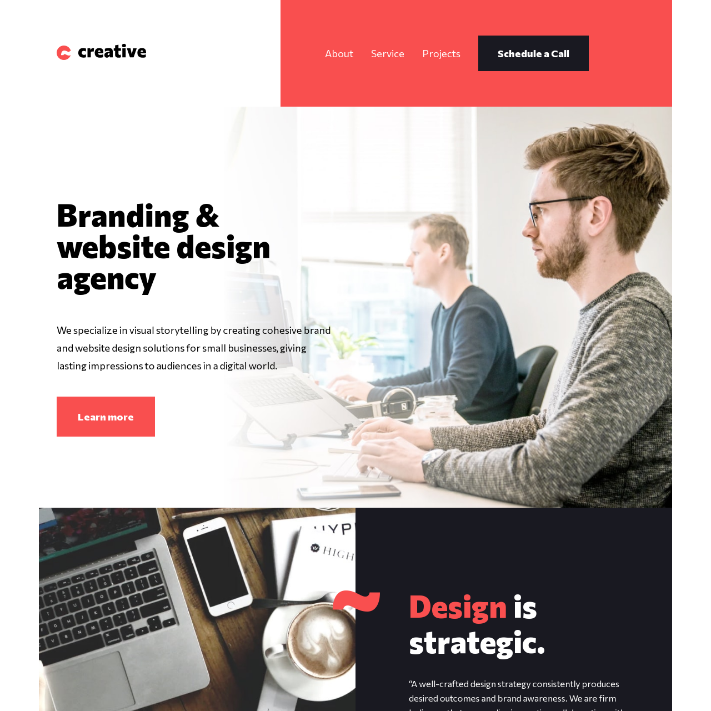

# Frontend Mentor - Creative agency single-page site

This is a solution to the [Creative agency single-page site challenge on Frontend Mentor](https://www.frontendmentor.io/challenges/creative-agency-singlepage-site-Pq6V3I2RM). Frontend Mentor challenges help you improve your coding skills by building realistic projects. 

## Overview
The layout of this site looked fairly challenging with the overlapping elements, so I chose it in order to practice using
CSS grid. The main struggle I had was getting the tablet / desktop layouts to look correct with CSS grid.
I managed to get my site somewhat close to the original design, though not 100%. I used the mobile first approach.

### The challenge

Users should be able to:

View the optimal layout for the site depending on their device's screen size
See hover states for all interactive elements on the page
Navigate the slider using either their mouse/trackpad or keyboard

### Screenshot

### Links

[Live Solution](https://bengera.github.io/creative-single-page/)

### Built with

- Semantic HTML5 markup
- SCSS/CSS
- Flexbox
- CSS Grid
- Vanilla JavaScript
- Mobile-first workflow

### Things that could be improved / worked on.

- The slider only works for the images, (I did not notice the changing text until later) I only managed to get the text to change
with the pictures using basic if / else statements, but I ran into problems with the logic of the code and ended up having the text match with the wrong image after clicking a certain number of times.

- The box that contains the text 'Brand naming & guidelines' is too small for the desktop size as I had some problems getting the design to match up with CSS grid.

- The desktop site and its content has a max width and does not stretch out on larger screens. I forgot to take this into consideration when defining the basic HTML structure and making the grids. If I were to attempt this again, I would redo the main section with a better grid system that would stretch out to the edge of the browser
rather than having everything centered.

